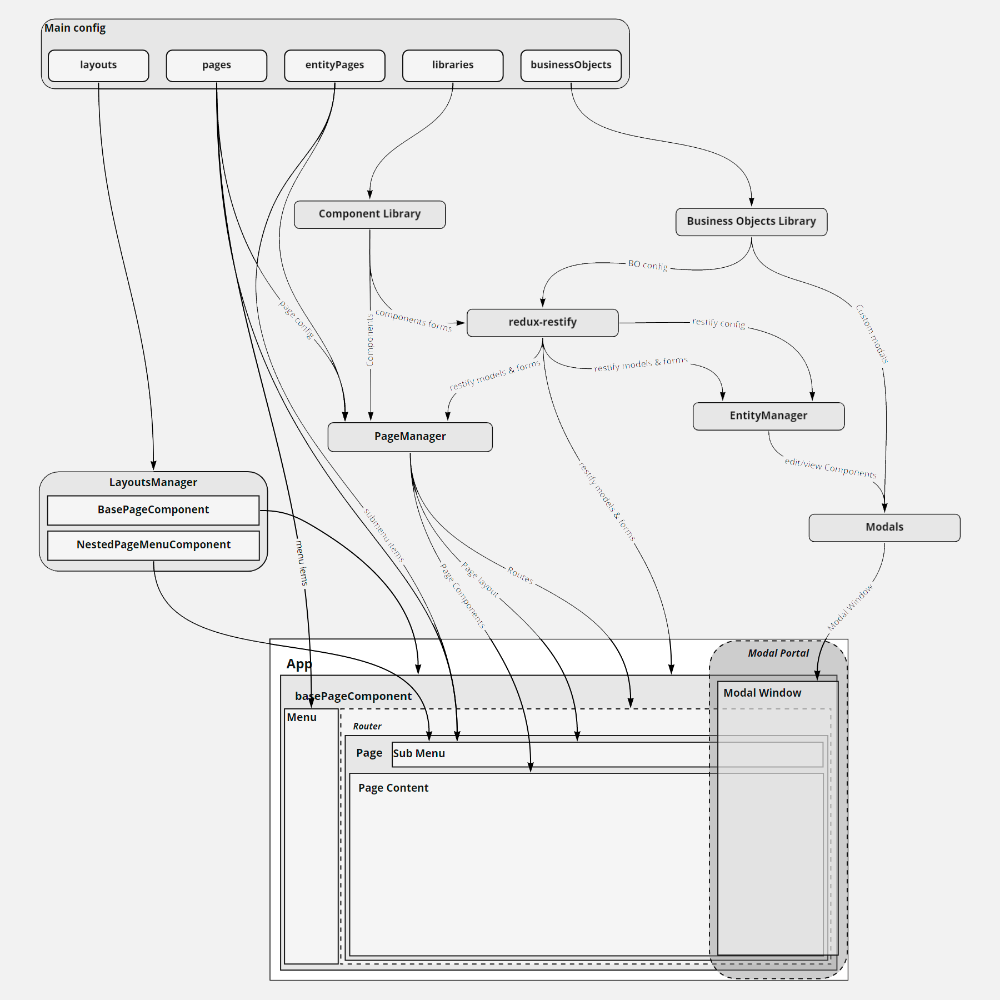

==================
Core architecture
==================

When you run start or build command - trood-core-react-script will go through the steps:

1. Create .trood-core directory in root of you project.

2. In this folder will be:

.. _more: `Project & core merge files rules`_

    * cloned frontend-trood-core from git repository
    * merged project files. more_
    * installed core and project dependencies

3. After that the webpack will be start or build your project

4. (Only for build) Build artifacts copied to root of you project.

********************
Core concept schema
********************

*********************************
Project & core merge files rules
*********************************

**.env**, **package-lock.json**, **yarn.lock**, **public/\*\***, **translate/\*\***

This files are fully rewrite in core, from your project

-----------------------------------------------------------

**package.json**

Project ``*dependencies`` concatenated with core ``*dependencies``

Project ``scripts`` rewrites from core ``scripts``

Other options saved from project

--------------------------------------------------------------

**CSS files in src folder**

if your redefine some of core **css** files in your project src, it will be concatenated:

For example:

*.trood-core/src/components/TInput/index.css* - ``.root { padding: 10px; }``

*src/components/TInput/index.css* - ``.root { padding: 0 10px; }``

in result: ``.root { padding: 10px; }   .root { padding: 0 10px; }``

.. important::

    CSS rule **exclude** folders: ``businessObjects``, ``componentLibraries``, ``layouts``

--------------------------------------------------------------

**Other files in src folder**

All other files in src are fully rewrite in core, from your project

----------------------------------------------------------------

**Other folders and files**

Other folders and files not merged to .trood-core and can't be use in project build
